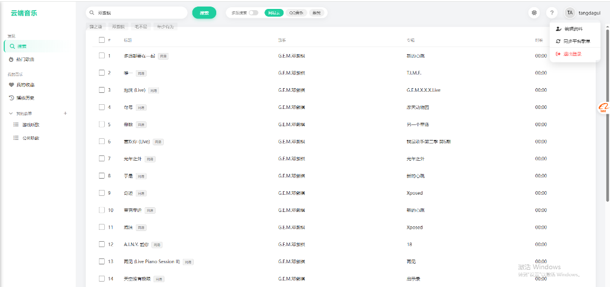
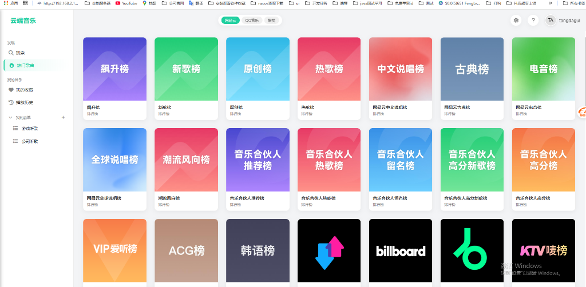
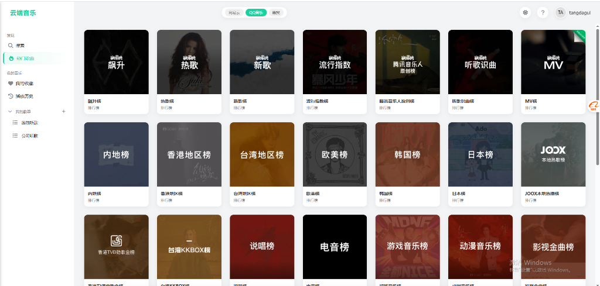
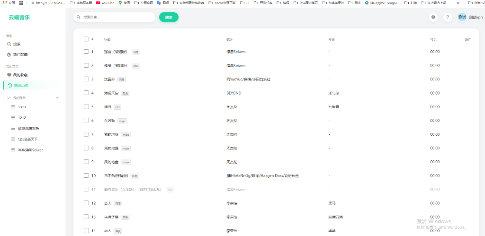
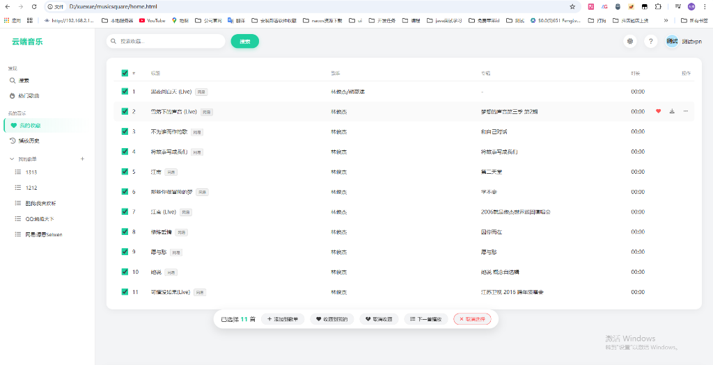

# 云端音乐 | MusicSquare

<p align="center">
  
  
  
</p>

一款功能强大的在线音乐播放器，支持多平台音源聚合搜索与播放。

> [!CAUTION]
> **免责声明**：本项目仅供学习和研究使用，不提供任何音频存储或下载。所有音频资源均来自第三方平台，版权归原作者所有。请勿将本项目用于任何商业用途。由使用本项目引起的一切法律责任由使用者自行承担。

---

## ⚠️ 重要说明

**本项目必须自行部署后端服务**。
README 中的默认 API 代理地址仅供演示，**严禁滥用**。若发现大规模调用，作者将采取限制措施并取消开源。部署完成后，请务必修改 `js/service.js` 中的 `API_BASE` 为你自己的地址。

## 🌐 在线体验

因为是部署在 GitHub Page 和 Cloudflare 上，免费额度有限，暂不提供公共演示地址，请按照下方指南自行部署。

## 📸 界面预览

### 搜索页面


### 热门歌曲 - 网易云


### 热门歌曲 - QQ音乐


### 热门歌曲 - 酷我音乐


### 播放历史


### 我的收藏（批量操作）


---

## ✨ 功能特色

### 🎵 多平台音源
- **聚合搜索**：一键搜索网易云音乐、QQ音乐、酷我音乐
- **智能匹配**：多源搜索自动去重，交替显示结果
- **音质优选**：自动降级选择最佳音质（Hi-Res → 无损 → 320K → 128K）

### 🎧 完整播放体验
- **歌词同步**：实时滚动歌词显示
- **封面展示**：高清专辑封面
- **播放模式**：顺序播放、单曲循环、随机播放
- **播放控制**：上一首、下一首、进度拖拽
- **音量控制**：音量调节与静音

### 📂 个人音乐库
- **用户系统**：注册登录，数据云端同步
- **我的收藏**：一键收藏喜欢的歌曲
- **自建歌单**：创建、编辑、删除个人歌单
- **播放历史**：自动记录播放历史

### 🔄 歌单同步
- **平台导入**：支持导入网易云、QQ音乐、酷我歌单
- **增量更新**：智能识别新增歌曲

### 🎨 界面设计
- **暗色模式**：支持明/暗主题切换
- **响应式布局**：适配桌面端与移动端
- **流畅动画**：精心设计的交互动画
- **批量操作**：多选模式批量添加收藏/歌单

---

## 🚀 部署指南

本项目支持两种部署方式：**Cloudflare Workers** (轻量/免费) 和 **Java 后端** (功能完整/自建)。

👉 **请务必阅读详细的 [部署手册 (DEPLOY.md)](DEPLOY.md)**

### 简要步骤

1.  **选择并部署后端**：
    *   **Cloudflare Workers**: 适合个人使用，无需服务器。
    *   **Java (Spring Boot)**: 适合云服务器部署，使用 MySQL 存储。

2.  **修改前端配置** (⚠️ **必须执行**)：
    无论选择哪种后端，都必须修改 `js/service.js` 文件：
    ```javascript
    // 找到 API_BASE 配置项，将其修改为您部署的后端地址
    const API_BASE = 'https://您的后端地址/api';
    ```

3.  **部署前端**：
    *   推荐使用 **GitHub Pages** 或 Vercel 托管前端静态文件。

> 详细的服务器环境配置、Nginx 设置及数据库初始化脚本，请查阅 [DEPLOY.md](DEPLOY.md)。

---

## 🛠️ 技术栈

| 类型 | 技术 |
|------|------|
| **前端** | HTML5, CSS3, Vanilla JavaScript |
| **UI** | Flexbox, Grid, FontAwesome 图标 |
| **后端 A** | Cloudflare Workers (V8 Runtime) |
| **后端 B** | Java Spring Boot (v3.x) |
| **数据库** | Cloudflare D1 / MySQL |
| **数据源** | [TuneHub API](https://tunehub.sayqz.com) + 自建跨域代理 |

---

## 📝 更新日志

### v2.0
- ✅ 多平台音源聚合，自动音质降级
- ✅ 云端同步收藏与自定义歌单
- ✅ 优化 Kuwo 图片反盗链及 SSL 证书错误
- ✅ 响应式 UI 适配及暗色模式

## 📄 许可证

本项目采用 [MIT License](LICENSE) 开源许可证。

## 🙏 致谢

- [TuneHub API](https://tunehub.sayqz.com) - 音乐数据接口
- [FontAwesome](https://fontawesome.com/) - 图标库
- [Cloudflare](https://cloudflare.com/) - 边缘计算平台
- [GitHub Pages](https://pages.github.com/) - 静态网站托管
- [原生项目](https://github.com/CharlesPikachu/musicsquare) - 简易轻量音乐平台

---

<p align="center">
  Made with ❤️ by <a href="https://github.com/7TangDaGui">7TangDaGui</a>
</p>
